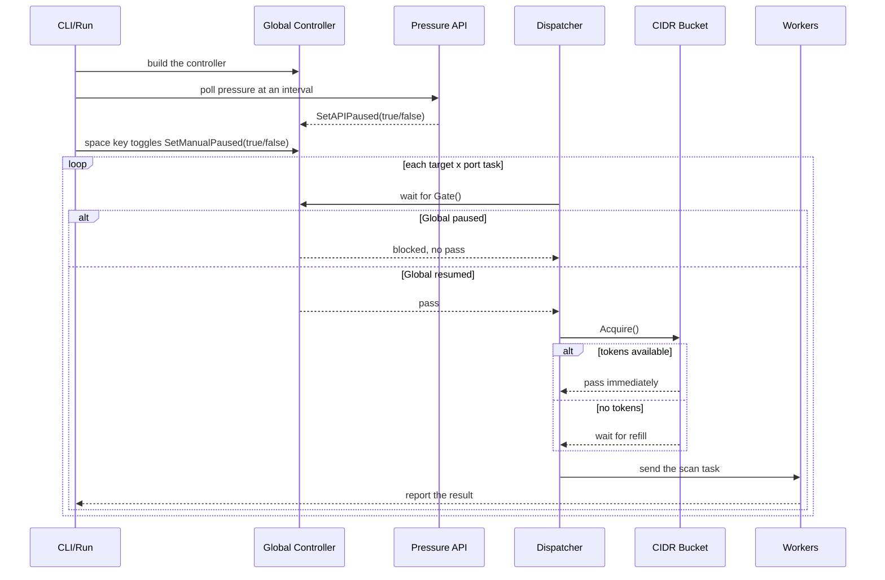

# Speed Control Explanation

This document explains the two layers of speed control in `port-scan-mk3`:

- `Global speed control`: a global pause/resume gate
- `CIDR scan speed control`: one leaky bucket for each CIDR chunk

Related diagrams:

- Mermaid diagram: in this document
- draw.io diagram: [speed-control-sequence.drawio](./speed-control-sequence.drawio)

## 1. Core Concepts

The current implementation divides speed control into two layers:

1. The global layer decides only if the `dispatcher` can send new tasks now.
2. The CIDR layer decides only the send rate of one CIDR chunk.

Both layers act in the task dispatch stage. They do not themselves stop a task that is already in a worker or already in a TCP dial.

## 2. Global Speed Control

The core of global control is `pkg/speedctrl/controller.go`.

- `Controller` keeps two pause flags:
  - `apiPaused`
  - `manualPaused`
- If one flag is `true`, `Gate()` blocks.
- `Gate()` lets tasks through only when both flags are `false`.

### 2.1 What changes the global gate

#### Manual pause

`pkg/speedctrl/keyboard.go` reads the keyboard in terminal raw mode.

- Press the space key one time: `manualPaused = true`
- Press it again: `manualPaused = false`

The `startManualPauseMonitor` function in `pkg/scanapp/pressure_monitor.go` only writes the state change to the log.

#### API pause

`pkg/scanapp/pressure_monitor.go` calls `-pressure-api` at a regular interval.

- When `pressure >= threshold`: `apiPaused = true`
- When `pressure < threshold`: `apiPaused = false`

More information:

- The CLI can control the polling interval: `-pressure-interval`
- The CLI can disable this layer completely: `-disable-api=true`
- The threshold is not a CLI flag now. The runtime default value is `60`
- If the API fails 3 times in sequence, the scan fails fast and stops

### 2.2 What the global gate actually blocks

Before each `scanTask`, `pkg/scanapp/task_dispatcher.go` waits:

```go
select {
case <-ctx.Done():
    return ctx.Err()
case <-ctrl.Gate():
}
```

The effects of global control are therefore:

- It stops the dispatch of new `scanTask` items
- It does not cancel a task that a worker already runs
- It does not take back a task that is already in `taskCh`

The gate is thus more like a master valve than a fixed rate limiter for each second.

## 3. CIDR Scan Speed Control

The core of CIDR speed control is in:

- `pkg/scanapp/scan.go`
- `pkg/ratelimit/leaky_bucket.go`

### 3.1 Each CIDR chunk has its own bucket

At runtime construction, each `chunkRuntime` builds its own bucket:

```go
bkt: ratelimit.NewLeakyBucket(cfg.BucketRate, cfg.BucketCapacity)
```

This design means that:

- `CIDR-A` has its own bucket
- `CIDR-B` has its own bucket

They do not share one token pool.

### 3.2 How the bucket operates

The rules of `LeakyBucket` are:

- At start, the bucket holds `capacity` tokens
- The bucket adds 1 token every `1/rate` seconds
- `Acquire()` must get a token before the dispatcher sends the next task

Therefore:

- `-bucket-capacity` sets the size of the initial burst
- `-bucket-rate` sets the steady-state task quota for each second after the burst

### 3.3 What unit the bucket limits

The bucket does not limit the number of IPs or the number of CIDRs. It limits this unit:

- one `target x port` = one dispatch task

For example:

- 3 IPs
- 2 ports

The total is `3 x 2 = 6 tasks`.

The bucket limits the dispatch rate of these 6 tasks.

## 4. Simple Sequence Diagram



## 5. Examples

### Case 1: one CIDR, constant low speed

Conditions:

- 1 CIDR
- 2 IPs
- 2 ports
- 4 tasks in total
- `-bucket-rate=2`
- `-bucket-capacity=1`
- `-delay=0`
- `-workers=10`

Derivation:

- At start there is 1 token only, so the dispatcher sends task 1 immediately
- After that, the bucket adds 1 token every `0.5s`
- The dispatcher sends tasks 2, 3, and 4 at approximately `0.5s`, `1.0s`, and `1.5s`

Result:

- The dispatch speed of this CIDR is approximately `2 tasks/sec`
- There is almost no burst

### Case 2: one CIDR, a burst and then a steady state

Conditions:

- 1 CIDR
- 20 tasks in total
- `-bucket-rate=10`
- `-bucket-capacity=20`
- `-delay=0`
- `-workers=20`

Derivation:

- At start the bucket holds 20 tokens
- The dispatcher can send almost all 20 tasks immediately

Result:

- At the start, 20 tasks go out quickly
- After the burst, the dispatch speed returns to `10 tasks/sec`

### Case 3: a global pause occurs

Conditions:

- `-pressure-interval=5s`
- The pressure threshold uses the runtime default `60`
- One API response is `{"pressure":95}`

Derivation:

- At the next poll, the controller enters the paused state
- The dispatcher waits at `Gate()`
- The dispatcher sends no new tasks
- Probes already in a worker continue to completion

If a later API response is `{"pressure":40}`:

- The controller returns to the open state
- The dispatcher continues to send tasks

### Case 4: two CIDRs, no fair round-robin rate

Now `dispatchTasks()` dispatches one chunk at a time, in `runtimes` order.

If:

- `CIDR-A` has 100 tasks
- `CIDR-B` has 100 tasks

the behavior is closer to this sequence:

1. Dispatch `CIDR-A` first
2. `CIDR-A` completes, or its dispatch completes
3. Then change to `CIDR-B`

The important point of the current design is therefore:

- Each CIDR has its own bucket

The design is not:

- Several CIDRs that share one global rate fairly, in round-robin order

### Case 5: `-delay` is also a speed factor

Conditions:

- `-bucket-rate=100`
- `-bucket-capacity=100`
- `-delay=50ms`

Derivation:

- The bucket is almost no limit here
- But the dispatcher still sleeps `50ms` after each task

Result:

- For the dispatcher alone, the theoretical maximum is approximately `20 tasks/sec`

## 6. Detailed Derivation

The derivation below uses this parameter set:

```bash
go run ./cmd/port-scan scan \
  -cidr-file cidr.csv \
  -port-file ports.csv \
  -bucket-rate 10 \
  -bucket-capacity 20 \
  -workers 5 \
  -delay 10ms
```

### 6.1 The control factors

This parameter set means:

- Steady-state bucket refill speed: `10 tasks/sec`
- Initial bucket burst capacity: `20 tasks`
- Minimum dispatcher interval between tasks: `10ms/task`
- Worker count: `5`
- Task channel size: `workers * 2 = 10`

### 6.2 The dispatcher alone

Because `-delay=10ms`, the theoretical dispatcher maximum is this value, even when nothing else blocks it:

- `1 / 0.01s = 100 tasks/sec`

`delay` is therefore not the main bottleneck of this parameter set.

### 6.3 The bucket alone

At start the bucket holds 20 tokens.

Therefore:

- The first 20 tasks can pass the bucket immediately
- Task 21 and the tasks after it wait for a refill
- The refill speed is 1 token every `100ms`

The steady-state bucket maximum is therefore:

- `10 tasks/sec`

### 6.4 Workers and queue backpressure

Two more conditions have an effect on the actual dispatch:

- A maximum of `5` workers run at the same time
- The `taskCh` buffer holds a maximum of `10` tasks

When the targets are slow, the system therefore holds a maximum of approximately:

- `5` in-flight tasks
- `10` queued tasks
- approximately `15` tasks in total that are sent but not yet processed

This limit means that:

- The bucket holds `20` initial tokens
- But the worker and queue capacity often stops the first wave at approximately `15` tasks
- The remaining tokens can stay in the bucket until the queue has free space again

### 6.5 The steady-state speed formula

The steady-state throughput is close to the minimum of these limits:

- bucket: `10 tasks/sec`
- delay: `100 tasks/sec`
- workers: `workers / average seconds for one task`

That is:

```text
steady_state_tps ~= min(
  bucket_rate,
  1 / delay_seconds,
  workers / avg_task_seconds
)
```

### 6.6 Two specific situations

#### Situation A: the targets are fast

Assume that one probe completes in `200ms` on average.

The maximum throughput from the workers is approximately:

- `5 / 0.2 = 25 tasks/sec`

A comparison of the three limits:

- bucket: `10/sec`
- delay: `100/sec`
- workers: `25/sec`

Result:

- The steady-state bottleneck is the bucket
- The long-term average speed is approximately `10 tasks/sec`

#### Situation B: the targets are slow

Assume that one probe completes in `2s` on average.

The maximum throughput from the workers is approximately:

- `5 / 2 = 2.5 tasks/sec`

A comparison of the three limits:

- bucket: `10/sec`
- delay: `100/sec`
- workers: `2.5/sec`

Result:

- The steady-state bottleneck changes to the workers
- The long-term average speed is approximately `2.5 tasks/sec`

### 6.7 Conclusion for this parameter set

This parameter set does not mean "10 for each second". A more exact description is:

- The bucket permits an initial burst quota of a maximum of 20 tasks
- But `5 workers + 10 queue` often stops the first burst first
- The long-term steady-state speed after that depends on the slowest of the bucket, the delay, and the workers/target latency

If the targets are generally not slow, this parameter set commonly behaves as follows:

- A short fast period at the start
- Then a fall to approximately `10 tasks/sec`

## 7. Workers × Timeout × Rate (measured relation)

Section 6.5 gives the steady-state formula. This section uses e2e mock measurements to explain how `-workers` changes the speed.

### 7.1 The key idea

`-workers` sets the maximum number of TCP dials that run at the same time (see the worker pool in `pkg/scanapp/executor.go`, and the `taskCh` buffer of `workers * 2`). Whether it becomes the bottleneck depends completely on the speed of one dial:

- **Fast targets (closed/RST, latency of approximately 1ms)**: `workers / latency` is very large. The bottleneck is always the dispatcher (`-bucket-rate` or `-delay`), and more workers give no help.
- **Slow targets (dropped packets, which reach `-timeout`)**: each dial takes the full `-timeout`. The throughput is approximately `workers / timeout`, and the worker count increases the speed linearly.

### 7.2 Measured data

Conditions: one host (one chunk = one bucket), 64 targets, `-timeout 200ms`, `-disable-api`, a `-bucket-rate` high enough to be no limit, and `-delay 0`. The dispatch time excludes the container startup baseline (approximately `0.25s`):

**Slow (timeout dials) — limited by the workers, with linear scaling:**

| workers | dispatch time | measured eff | predicted `workers/timeout` |
|---|---|---|---|
| 1  | 12.85s | ~5/s    | 5/s   |
| 4  | 3.25s  | 19.7/s  | 20/s  |
| 16 | 0.80s  | 79.8/s  | 80/s  |
| 64 | 0.21s  | 304.8/s | 320/s |

**Fast (RST dials) — the worker count has almost no effect:**

| workers | wall time |
|---|---|
| 1  | 0.255s |
| 8  | 0.245s |
| 64 | 0.230s |

In the fast situation, 1 worker and 64 workers give almost the same result. The bottleneck is the dispatcher, not the workers.

### 7.3 Sizing rule (Little's law)

To hold a target rate `R` when the slowest dial takes `T` (usually equal to `-timeout`):

```text
workers >= R * T
```

For example, for a target of `256 targets/sec` and `-timeout 200ms`:

- You need `workers >= 256 * 0.2 ≈ 52`
- With `-workers 32` only, a timeout-heavy network holds the scan at approximately `160/s`. That rate is less than `-bucket-rate 256`, and the scan reports no error (a silent speed decrease)

In the opposite direction, more `-workers` never gives a rate higher than `-bucket-rate`. When `workers / latency >= bucket_rate`, the extra workers stay idle.

### 7.4 The task of each control

- `-bucket-rate`: sets the maximum speed.
- `-workers`: decides if the scan can reach that maximum at the given dial latency.

For a network in which some targets reach the timeout, the recommended parameter set for a real 256/s is therefore:

```bash
port-scan scan -cidr-file rich.csv \
  -bucket-rate 256 -bucket-capacity 256 -delay 0 \
  -workers 64 -timeout 200ms \
  -output scan_results.csv
```

`-workers 64` (which is `>= 256 × 0.2`) makes sure that the worker throughput fills the 256/s bucket quota, even when each dial reaches the timeout.

> Data source: measurements against `mock-target-open` in `e2e/docker-compose.yml`. The fast situation dials a closed port (RST). The slow situation dials an unassigned IP in the subnet and adds `-disable-pre-scan-ping` to force the TCP dial to the timeout.

## 8. Code References

- Global controller: `pkg/speedctrl/controller.go`
- Keyboard manual pause: `pkg/speedctrl/keyboard.go`
- Pressure API pause: `pkg/scanapp/pressure_monitor.go`
- Dispatch gate + bucket acquire: `pkg/scanapp/task_dispatcher.go`
- Per-CIDR bucket construction: `pkg/scanapp/scan.go`
- Bucket implementation: `pkg/ratelimit/leaky_bucket.go`
